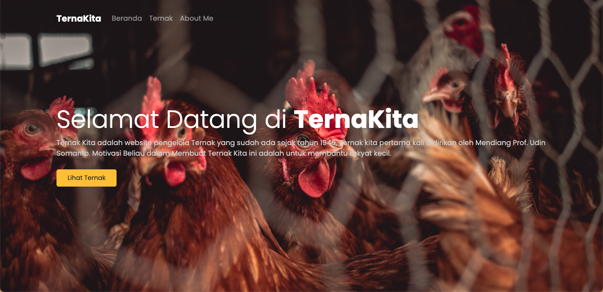

# TernaKita

This is a simple CRUD (Create, Read, Update, Delete) application built using PHP with the MVC (Model-View-Controller) pattern.



## Getting Started

These instructions will get you a copy of the project up and running on your local machine for development and testing purposes.

### Prerequisites

What things you need to install the software and how to install them:

- PHP (version 7.4 or newer)
- MySQL (version 5.6 or newer)
- Web Server (such as Apache, Nginx, etc)

### Installation

1. Clone this repository to your local machine:

```bash
git clone https://github.com/lucifergotmad/ternakita.git
```

2. Navigate to the project folder:

```bash
cd ternakita
```

3. Create a new MySQL database and import the `ternakita_db.sql` file (replace 'database_name' with your database name):

```bash
mysql -u username -p database_name < ternakita_db.sql
```

4. Update the `config.php` file with your database credentials.

5. Start your web server and navigate to the project in your web browser.

### Contributing

If you want to contribute to this project and make it better, your help is very welcome.

Build with passion by  @lucifergotmad
